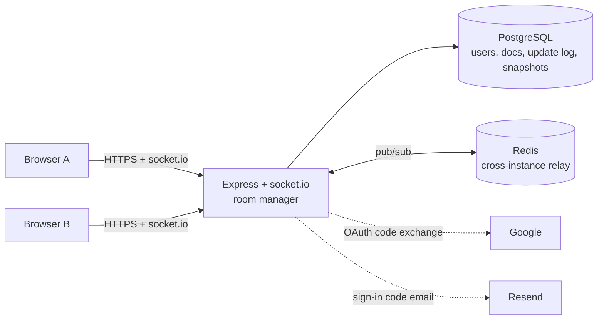

# CollabNotes

A real-time collaborative rich-text editor. Several people edit one document at the same time, see each other's cursors live, and never resolve a merge conflict — the merge is done by a CRDT, not by a person.

**Stack:** React + TypeScript + Tiptap · Node/Express + socket.io · Yjs (CRDT) · PostgreSQL · Redis

## Features

- **Real-time co-editing** — Yjs CRDT sync over socket.io; concurrent edits merge losslessly, edits made offline sync on reconnect.
- **Live presence** — collaborator avatars and labelled cursors (name + colour, never colour alone).
- **Rich text** — bold, italic, underline, strikethrough, code, H1–H3, bullet/numbered lists, quotes, links.
- **Passwordless auth** — sign in with a 6-digit code emailed through Resend, or with Google. There are no passwords to leak, reuse or reset. Short-lived JWT access tokens with rotating refresh tokens and reuse detection.
- **Sharing** — invite by email (including people with no account yet) with an optional **Notify by email** checkbox that sends a branded invitation, share links scoped to Editor or Viewer, instant revocation that disconnects live sessions.
- **Search** — full-text search inside documents (not just titles): word forms ("planning" finds "plan"), as-you-type prefixes, "quoted phrases" and -exclusions, highlighted snippets, and a **Ctrl/Cmd+K** quick switcher.
- **Export** — download a document as Markdown, copy it as Markdown, or print / save as PDF.
- **Version history** — automatic snapshots plus one-click restore that updates every connected client live, no reload.
- **Roles** — Owner / Editor / Viewer, enforced server-side on every REST call and every socket message.

## Architecture



**One edit, end to end:** the local Yjs doc updates instantly and Tiptap re-renders → the binary update is emitted over the socket → the server applies it to its in-memory doc, appends it to `document_updates`, relays it verbatim to the room, and publishes it on Redis for any other server instance. The server never interprets, transforms or reorders an update — correctness is entirely the CRDT's job.

### Decisions worth knowing about

**CRDT (Yjs) rather than Operational Transform.** OT needs a central sequencing authority and is notoriously hard to get right; Yjs merges deterministically without one, which is also what lets the server scale horizontally.

**Custom Postgres + Redis persistence rather than `y-redis`.** `y-redis` is AGPL/commercial-licensed. The pattern is small enough to own: Redis is a transient bus, Postgres is the durable store. Redis holds nothing that matters — losing it is an availability blip, not data loss.

**socket.io rather than raw `ws`.** Rooms map directly onto "one room per document", named events replace a hand-rolled message-type byte, and built-in reconnection with backoff covers most of the offline story.

**The sync handshake is bidirectional.** On every (re)connect the server answers the client's state vector with what the client lacks *and* sends its own state vector so the client can push back what the server lacks. A one-way handshake silently drops edits made while offline — this was found by test, not by inspection (see *Testing*).

**Restore is a delete-and-reinsert, not a merge.** Yjs merges are additive: applying an old snapshot on top of newer state would add content back but never remove what came after. Restore instead clears the live document and re-inserts clones of the snapshot's nodes as one ordinary transaction, so it flows through the same persist/relay path as any edit and every client applies it live.

**Snapshots carry a cutoff.** Each snapshot records the last `document_updates.id` folded into it, and hydration replays only updates after that. Without the cutoff, a restore would look right in the live session and then be silently undone the next time the document loaded, because hydration would replay the abandoned edits back in. Rows are never deleted — old updates are just skipped.

**Access is a server-side fact, never client state.** The role in `document_access` is re-checked on every REST call and on every socket message. A Viewer's write is rejected server-side even if a crafted client sends one; a removed collaborator's socket is disconnected within one round trip; a downgraded one is switched to read-only in place.

**Pending invites.** Inviting an email with no account stores the invite against the email and resolves it the moment that address first signs in (with an emailed code or Google).

**Search is built into Postgres, and the permission check is part of the query.** A document is stored as a binary Yjs update log, not text, so the server flattens each document to plain text a few seconds after edits stop (debounced per document, so typing is one re-index, not hundreds) and stores it beside a generated `tsvector` column with a GIN index. Titles are weighted above body text. No separate search service to run. Results only ever include documents the caller owns or has been resolved onto — the access check is in the SQL itself, so a document you can't open is never selected and can't leak through ranking or counts. Snippets are highlighted with two control characters that are stripped from every document at extraction time (so content can't fake a match) and rendered as React text nodes, never HTML. Documents that predate the feature, or were edited just before a restart, are re-indexed by a background backfill at startup. Re-indexing also finally makes `updated_at` follow content edits (before, only a rename moved it).

**Export runs in the browser.** Markdown comes from Tiptap's official extension, so nothing goes through the server and nothing is exposed beyond what the person can already read (viewers can export too). PDF is the browser's print dialog driven by a print stylesheet, rather than a headless browser on the server, which would be heavy on a free instance.

**Invitation emails are fenced, and never gate the share.** "Notify by email" lets a signed-in owner make the app email an address of their choosing, which is exactly the shape of a spam or phishing relay — so it's limited four independent ways before anything is sent: a 10-minute cooldown per document+address (flipping a role back and forth doesn't re-send), 20 per owner per hour, 5 per recipient per day, and the shared daily budget, which invitations stop short of so a burst of them can never leave someone unable to log in. It only sends when access actually changed, links to the document with **no token** (access is tied to the recipient's verified email, so a forwarded email grants a stranger nothing), and escapes every name and title. The share succeeds first and the email is best-effort: if it's limited or fails, the owner is told "shared, but not emailed" and can send the link themselves.

**A code, not a magic link.** Email security scanners (Outlook Safe Links, corporate gateways) open every link in an email to check it — which silently uses up a single-use magic link before the person clicks it. A code has no link to prefetch, and it binds the sign-in to the browser that asked for it. A 6-digit code is a small search space, so the protections are layered: it is stored only as an HMAC bound to the address; expires in 10 minutes; allows 5 wrong guesses, counted **atomically before the comparison** (comparing first and counting after lets a burst of parallel guesses each try a different value — there's a test for exactly that); is single-use; and a new code invalidates the old one. Requests are answered identically whether or not an account exists, so the form can't be used to find out who has one.

### Security posture (OWASP Top 10:2025)

| Area | Approach |
|---|---|
| Broken access control | Per-request server-side role checks; a user with no access gets `404`, never `403`, so a document's existence isn't confirmed |
| Injection | Parameterized queries only; zod validation on every input |
| Authentication | Passwordless: emailed one-time codes (HMAC at rest, 10-min expiry, 5 guesses/code, single use, per-address cooldown); refresh-token rotation with reuse detection that revokes the whole token family; tokens hashed at rest; JWT algorithm pinned to HS256 |
| Rate limiting | Per-IP, per-address, and a global daily send cap (protects the email quota from being drained). The client address comes from Express with an explicit `TRUST_PROXY` hop count — **never** from a client-supplied `X-Forwarded-For`, which lets anyone pick a fresh "IP" per request and walk past every limit |
| Google sign-in | Authorization-code flow with a single-use `state` (stops login CSRF); only `email_verified` addresses accepted (accounts are matched by email, so an unverified one would allow takeover) |
| Hostile socket input | Every payload shape-checked and size-capped; per-socket budgets (presence is dropped, floods disconnected); every handler wrapped, because on Node 22 one escaped exception ends every live session — a malformed update from any editor used to be able to do exactly that |
| Misconfiguration | `helmet`, strict CORS allowlist (no credentials), 20 KB JSON body cap, `Cache-Control: no-store` on auth responses, central error handler that never leaks internals |
| Search | Access check inside the SQL (owner or resolved collaborator only; pending invites match nothing); `websearch_to_tsquery` never throws on odd input; `%`/`_` matched literally; per-user rate limit; highlights delimited by control characters stripped from content and rendered as text, not HTML |
| Invitation emails | Opt-in per invite; only on changed access; cooldown per document+address, per-owner and per-recipient caps, and a daily budget that reserves headroom for sign-in codes; token-free link; everything user-supplied escaped and Subject-sanitised; a failed or suppressed email never blocks the share |
| Browser hardening | Content-Security-Policy (`script-src 'self'`, connections only to the API), `nosniff`, frame-deny, strict referrer policy (keeps share-link tokens out of `Referer`), HSTS; the post-login redirect rejects the backslash and tab-in-URL tricks browsers normalise into open redirects |
| Supply chain | Lockfile-pinned; `npm audit --omit=dev` is clean of critical/high |
| Share links | 256-bit random tokens; revocation is immediate |

## Getting started

Requires Node ≥ 18, PostgreSQL 16 and Redis 7.

1. `cp .env.example .env` and fill it in.
2. Start Postgres and Redis (Docker is the quickest way; use a different host port if 5432 is taken and update `DATABASE_URL`):
   ```bash
   docker run -d --name collabnotes-pg -e POSTGRES_PASSWORD=postgres -e POSTGRES_DB=collabnotes -p 5432:5432 postgres:16
   docker run -d --name collabnotes-redis -p 6379:6379 redis:7
   ```
3. Install, migrate, run:
   ```bash
   npm install
   npm run migrate
   npm run dev
   ```
   API on `http://localhost:4000`, web on `http://localhost:5173`.

### Environment

| Variable | Purpose |
|---|---|
| `DATABASE_URL`, `REDIS_URL` | Postgres / Redis connection strings |
| `JWT_SECRET` | Signing key for access tokens — use a long random value |
| `CORS_ORIGIN` | Allowed frontend origin(s), comma-separated |
| `RESEND_API_KEY` | Resend API key for sign-in emails (**secret** — set it in the host's dashboard, never commit it) |
| `EMAIL_FROM` | Sender, e.g. `CollabNotes <auth@yourdomain.com>`. Defaults to `onboarding@resend.dev`, which Resend only lets deliver to the account owner's own address until a domain is verified |
| `EMAIL_TRANSPORT` | `resend` (default), `console` (print codes to the log, local dev) or `outbox` (in-memory, used by the E2E suite; **refused when `NODE_ENV=production`**) |
| `SEARCH_INDEX_DEBOUNCE_MS` | How long after the last edit a document's searchable text is refreshed (default 10000) |
| `EMAIL_DAILY_LIMIT`, `EMAIL_SIGNIN_RESERVE`, `OTP_RESEND_COOLDOWN_SECONDS` | Sends per UTC day across everyone (default 90 — Resend's free tier is 100), how many of those slots only sign-in codes may use (default 30, so invitations stop at 60), and the gap between codes to one address (default 30) |
| `TRUST_PROXY` | Number of reverse proxies in front of the API (default 0). Set it correctly in production or per-IP rate limits key on the load balancer |
| `GOOGLE_CLIENT_ID` / `_SECRET` / `GOOGLE_REDIRECT_URI` | Google OAuth (optional) |
| `VITE_GOOGLE_CLIENT_ID` / `VITE_GOOGLE_REDIRECT_URI` | Same, for the frontend build |
| `VITE_API_URL`, `VITE_WS_URL` | API / socket URLs baked into the frontend build |
| `ACCESS_TOKEN_TTL`, `REFRESH_TOKEN_TTL_DAYS` | Token lifetimes (default 15m / 30d) |
| `SNAPSHOT_INTERVAL_MS` | Auto-snapshot interval (default 10 min) |
| `AUTH_RATE_LIMIT_MAX` | Code requests per IP per 15 min (default 20; verification allows 3×) |
| `REDIS_RELAY` | `false` to disable the cross-instance relay on a single-instance deploy (default `true`) |
| `SERVE_WEB` | `true` to serve the built frontend from the API process (default `false`) |

## Testing

```bash
npm run lint && npm run typecheck && npm run test && npm run build   # pre-merge checklist
npm run e2e                                                          # Playwright, needs Postgres + Redis
```

- **API tests (Vitest, real Postgres/Redis/sockets):** concurrent-edit merge, viewer-write rejection, restore-then-reload, sharing/pending-invite resolution, live-kick on removal, role change mid-session, document deleted while open, **100 disconnect/reconnect cycles with zero lost or duplicated edits**; and for auth: code single-use, expiry, the guess cap under a *parallel* burst, no account enumeration, send-failure handling, the daily cap, the exact Resend request, the rate limiter ignoring a spoofed `X-Forwarded-For`, and a suite of hostile socket payloads (each verified to fail against the old handler).
- **Measured targets:** p95 relay latency ≈ 7 ms on a single instance (target < 300 ms); 5 simultaneous editors converge with nothing lost. The cross-instance Redis path is designed for but not load-measured.
- **E2E (Playwright, isolated browser contexts per user; sign-in reads the code from an in-memory outbox):** passwordless sign-in (new account, returning user, wrong code, resend, forged OAuth callback, open-redirect attempt), invitation emails (the recipient follows the link while signed out, signs in, and lands on the document; the quiet and already-shared paths), search (content match with a highlighted snippet, word forms and prefixes, a stranger finding nothing until the document is shared, the Ctrl+K switcher), export (the real download and its contents, the clipboard, the print layout in dark mode), and a regression test that a read-only viewer never sees a bogus error, create → share → collaborate, join via link (login redirect, read-only viewer, revoked link), restore a version live, role change mid-session, keyboard focus management, 375 px responsive layout. `npm run e2e` starts its own servers, so stop any on `:4000`/`:5173` first. Set `PW_CHANNEL=chrome` (or `msedge`) to use an installed browser instead of downloading Chromium.
- **Accessibility:** an axe-core WCAG 2.x A/AA scan runs over every screen — sign-in and its error states, code entry, dashboard, editor, share dialog, version history, 404 — in both light and dark mode, and has already caught an unnamed editor and undersized touch targets. Dialogs manage focus and trap Tab; every icon-only control has an accessible name; there's a skip link and per-route page titles.

Two real bugs surfaced only because behaviour was tested rather than assumed: offline edits were being dropped on reconnect (fixed by the bidirectional handshake above), and a newly joined client couldn't see collaborators who were already present (fixed with an `awareness:query` that asks existing members to re-announce themselves).

## Deploying

Production runs the compiled server directly — no container required.

```bash
npm ci
npm run build          # shared → api (also copies SQL migrations to dist/) → web
npm run migrate:prod   # applies pending migrations from dist/
npm start              # node apps/api/dist/server.js
```

- The API and WebSocket run in one process; the host must allow WebSocket upgrades. Set `NODE_ENV=production`.
- **Single service (simplest):** set `SERVE_WEB=true` and the API also serves `apps/web/dist` with an SPA fallback, so deep links and share links (`/share/:token`) work on a direct visit. Build the frontend for same-origin URLs: `VITE_API_URL=/api/v1` and leave `VITE_WS_URL` unset. (On Windows Git Bash, prefix the build with `MSYS_NO_PATHCONV=1` — it otherwise rewrites the leading `/` into a Windows path.)
- **Or split it (frontend on Vercel, API on Render):** the repo's `vercel.json` handles the build and the SPA rewrite so deep links and `/share/:token` work. In Vercel set `VITE_API_URL=https://<api-host>/api/v1` and `VITE_WS_URL=https://<api-host>` (baked in at **build time** — redeploy after changing them; never put a secret in a `VITE_` variable, they are public). On the API set `CORS_ORIGIN` to the exact Vercel origin (`https://<project>.vercel.app`, no trailing slash) and leave `SERVE_WEB` false. Vercel preview URLs are different origins and are not allowed unless listed in `CORS_ORIGIN`.
- **Email (Resend):** create an API key and set `RESEND_API_KEY` on the API host. To send to *anyone* (not just your own address), verify a sending domain in Resend and set `EMAIL_FROM` to an address on it. Set `NODE_ENV=production` and `TRUST_PROXY` to the number of proxies in front of the API (**on Render it is `3`** — measured, not assumed: the app sees a local socket peer, then `X-Forwarded-For` ends `client, Cloudflare edge, Render internal proxy`. A lower value resolves to one of those proxy addresses, which varies per request, so the limit silently never fires; a higher one trusts a header the client can write. If you move hosts, re-measure: log `req.headers['x-forwarded-for']` for a request you sent with a fake one, and count the hops to your real address).
- **Managed data stores:** any Postgres works (Neon: use its connection string with `sslmode=require`) and any Redis that speaks the native protocol over TLS (Upstash: the `rediss://` URL). With a **single API instance** set `REDIS_RELAY=false` so edits and cursor moves aren't published to Redis for nobody — this matters on hosted free tiers that meter commands. Redis failures never break editing: publishes fail soft and the server carries on as a single instance.
- It scales horizontally: any number of API instances behind a load balancer, coordinated through Redis. Sticky sessions aren't required for correctness.
- Health check: `GET /health` (200 when Postgres and Redis are reachable, 503 otherwise).

## Project layout

```
apps/api         Express API + socket.io realtime layer
  src/modules      auth, documents, sharing, snapshots (routes → controller → service)
  src/realtime     room manager, persistence, snapshot job, restore
  src/db           migrations and queries
apps/web         React SPA (Vite), Playwright e2e in e2e/
packages/shared  DTOs, error codes and the socket event contract shared by both apps
```

## Known limitations

- Awareness (presence) re-announcement on join reaches collaborators on the same server instance; across instances they appear on their next cursor move or Yjs's ~15 s renewal.
- Access and refresh tokens are kept in `localStorage`, so a successful XSS could read them. The CSP (`script-src 'self'`) and React's escaping are the mitigation; HttpOnly cookies would be stronger but need the frontend and API on one site (a custom domain), which the free-tier split deployment doesn't have.
- A socket's JWT is verified at connect, not re-checked as it expires; access removal and role changes are enforced separately and immediately. A logged-out session's already-open sockets live until they disconnect.
- With the default Resend sender, codes can only be delivered to the Resend account owner until a domain is verified. Google sign-in works for everyone in the meantime.
