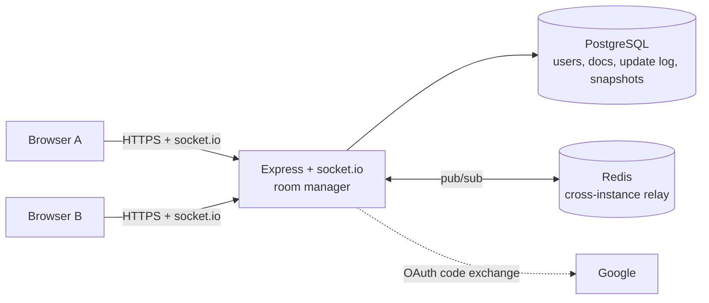

# CollabNotes

A real-time collaborative rich-text editor. Several people edit one document at the same time, see each other's cursors live, and never resolve a merge conflict — the merge is done by a CRDT, not by a person.

**Stack:** React + TypeScript + Tiptap · Node/Express + socket.io · Yjs (CRDT) · PostgreSQL · Redis

## Features

- **Real-time co-editing** — Yjs CRDT sync over socket.io; concurrent edits merge losslessly, edits made offline sync on reconnect.
- **Live presence** — collaborator avatars and labelled cursors (name + colour, never colour alone).
- **Rich text** — bold, italic, underline, H1–H3, bullet/numbered lists, links.
- **Auth** — email/password (bcrypt) and Google OAuth; short-lived JWT access tokens with rotating refresh tokens and reuse detection.
- **Sharing** — invite by email (including people with no account yet), share links scoped to Editor or Viewer, instant revocation that disconnects live sessions.
- **Version history** — automatic snapshots plus one-click restore that updates every connected client live, no reload.
- **Roles** — Owner / Editor / Viewer, enforced server-side on every REST call and every socket message.

## Architecture



**One edit, end to end:** the local Yjs doc updates instantly and Tiptap re-renders → the binary update is emitted over the socket → the server applies it to its in-memory doc, appends it to `document_updates`, relays it verbatim to the room, and publishes it on Redis for any other server instance. The server never interprets, transforms or reorders an update — correctness is entirely the CRDT's job.

### Decisions worth knowing about

**CRDT (Yjs) rather than Operational Transform.** OT needs a central sequencing authority and is notoriously hard to get right; Yjs merges deterministically without one, which is also what lets the server scale horizontally.

**Custom Postgres + Redis persistence rather than `y-redis`.** `y-redis` is AGPL/commercial-licensed. The pattern is small enough to own: Redis is a transient bus, Postgres is the durable store. Redis holds nothing that matters — losing it is an availability blip, not data loss.

**socket.io rather than raw `ws`.** Rooms map directly onto "one room per document", named events replace a hand-rolled message-type byte, and built-in reconnection with backoff covers most of the offline story.

**The sync handshake is bidirectional.** On every (re)connect the server answers the client's state vector with what the client lacks *and* sends its own state vector so the client can push back what the server lacks. A one-way handshake silently drops edits made while offline — this was found by test, not by inspection (see *Testing*).

**Restore is a delete-and-reinsert, not a merge.** Yjs merges are additive: applying an old snapshot on top of newer state would add content back but never remove what came after. Restore instead clears the live document and re-inserts clones of the snapshot's nodes as one ordinary transaction, so it flows through the same persist/relay path as any edit and every client applies it live.

**Snapshots carry a cutoff.** Each snapshot records the last `document_updates.id` folded into it, and hydration replays only updates after that. Without the cutoff, a restore would look right in the live session and then be silently undone the next time the document loaded, because hydration would replay the abandoned edits back in. Rows are never deleted — old updates are just skipped.

**Access is a server-side fact, never client state.** The role in `document_access` is re-checked on every REST call and on every socket message. A Viewer's write is rejected server-side even if a crafted client sends one; a removed collaborator's socket is disconnected within one round trip; a downgraded one is switched to read-only in place.

**Pending invites.** Inviting an email with no account stores the invite against the email and resolves it the moment that address registers (or first signs in with Google).

### Security posture (OWASP Top 10:2025)

| Area | Approach |
|---|---|
| Broken access control | Per-request server-side role checks; a user with no access gets `404`, never `403`, so a document's existence isn't confirmed |
| Injection | Parameterized queries only; zod validation on every input |
| Authentication | bcrypt (cost 12); rate-limited auth endpoints; refresh-token rotation with reuse detection that revokes the whole token family; tokens hashed at rest |
| Misconfiguration | `helmet`, strict CORS allowlist, central error handler that never leaks internals |
| Supply chain | Lockfile-pinned; `npm audit --omit=dev` is clean of critical/high |
| Share links | 256-bit random tokens; revocation is immediate |

## Getting started

Requires Node ≥ 18, PostgreSQL 16 and Redis 7.

1. `cp .env.example .env` and fill it in.
2. Start Postgres and Redis (Docker is the quickest way; use a different host port if 5432 is taken and update `DATABASE_URL`):
   ```bash
   docker run -d --name collabnotes-pg -e POSTGRES_PASSWORD=postgres -e POSTGRES_DB=collabnotes -p 5432:5432 postgres:16
   docker run -d --name collabnotes-redis -p 6379:6379 redis:7
   ```
3. Install, migrate, run:
   ```bash
   npm install
   npm run migrate
   npm run dev
   ```
   API on `http://localhost:4000`, web on `http://localhost:5173`.

### Environment

| Variable | Purpose |
|---|---|
| `DATABASE_URL`, `REDIS_URL` | Postgres / Redis connection strings |
| `JWT_SECRET` | Signing key for access tokens — use a long random value |
| `CORS_ORIGIN` | Allowed frontend origin(s), comma-separated |
| `GOOGLE_CLIENT_ID` / `_SECRET` / `GOOGLE_REDIRECT_URI` | Google OAuth (optional) |
| `VITE_GOOGLE_CLIENT_ID` / `VITE_GOOGLE_REDIRECT_URI` | Same, for the frontend build |
| `VITE_API_URL`, `VITE_WS_URL` | API / socket URLs baked into the frontend build |
| `ACCESS_TOKEN_TTL`, `REFRESH_TOKEN_TTL_DAYS` | Token lifetimes (default 15m / 30d) |
| `SNAPSHOT_INTERVAL_MS` | Auto-snapshot interval (default 10 min) |
| `AUTH_RATE_LIMIT_MAX` | Auth requests per IP per 15 min (default 10) |

## Testing

```bash
npm run lint && npm run typecheck && npm run test && npm run build   # pre-merge checklist
npm run e2e                                                          # Playwright, needs Postgres + Redis
```

- **API tests (Vitest, real Postgres/Redis/sockets):** concurrent-edit merge, viewer-write rejection, restore-then-reload, sharing/pending-invite resolution, live-kick on removal, role change mid-session, document deleted while open, and **100 disconnect/reconnect cycles with zero lost or duplicated edits**.
- **Measured targets:** p95 relay latency ≈ 7 ms on a single instance (target < 300 ms); 5 simultaneous editors converge with nothing lost. The cross-instance Redis path is designed for but not load-measured.
- **E2E (Playwright, isolated browser contexts per user):** create → share → collaborate, join via link (login redirect, read-only viewer, revoked link), restore a version live, role change mid-session, keyboard focus management, 375 px responsive layout. `npm run e2e` starts its own servers, so stop any on `:4000`/`:5173` first. Set `PW_CHANNEL=chrome` (or `msedge`) to use an installed browser instead of downloading Chromium.
- **Accessibility:** contrast for every design-token pair is checked by `apps/web/scripts/contrast-check.mjs` (the check caught a failing accent and a failing collaborator colour); dialogs manage focus and trap Tab; every icon-only control has an accessible name.

Two real bugs surfaced only because behaviour was tested rather than assumed: offline edits were being dropped on reconnect (fixed by the bidirectional handshake above), and a newly joined client couldn't see collaborators who were already present (fixed with an `awareness:query` that asks existing members to re-announce themselves).

## Deploying

Production runs the compiled server directly — no container required.

```bash
npm ci
npm run build          # shared → api (also copies SQL migrations to dist/) → web
npm run migrate:prod   # applies pending migrations from dist/
npm start              # node apps/api/dist/server.js
```

- The API and WebSocket run in one process; the host must allow WebSocket upgrades. Set `NODE_ENV=production`.
- Serve `apps/web/dist` from any static host. `VITE_API_URL` / `VITE_WS_URL` are baked in at **build time**, so build with the production URLs.
- It scales horizontally: any number of API instances behind a load balancer, coordinated through Redis. Sticky sessions aren't required for correctness.
- Health check: `GET /health` (200 when Postgres and Redis are reachable, 503 otherwise).

## Project layout

```
apps/api         Express API + socket.io realtime layer
  src/modules      auth, documents, sharing, snapshots (routes → controller → service)
  src/realtime     room manager, persistence, snapshot job, restore
  src/db           migrations and queries
apps/web         React SPA (Vite), Playwright e2e in e2e/
packages/shared  DTOs, error codes and the socket event contract shared by both apps
```

## Known limitations

- Awareness (presence) re-announcement on join reaches collaborators on the same server instance; across instances they appear on their next cursor move or Yjs's ~15 s renewal.
- Tiptap is on 2.x; a moderate upstream advisory is fixed only in 3.x, and the migration is planned as its own change.
- Email verification and password reset are out of scope for the MVP.
