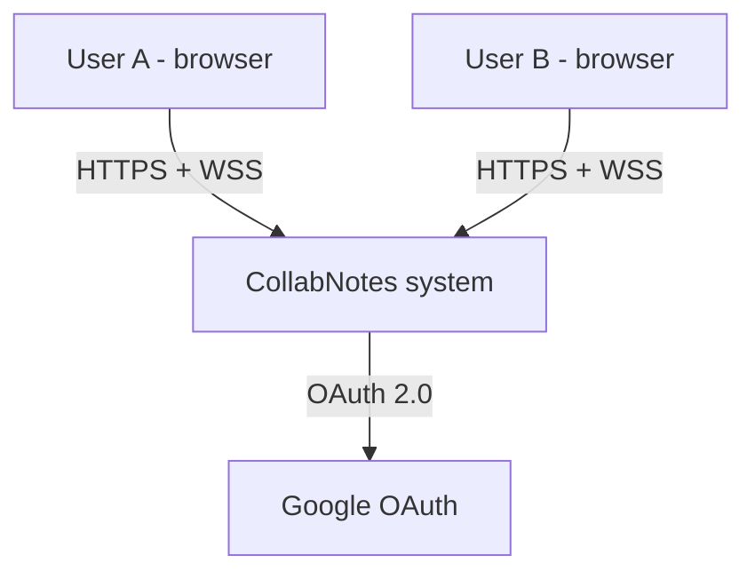
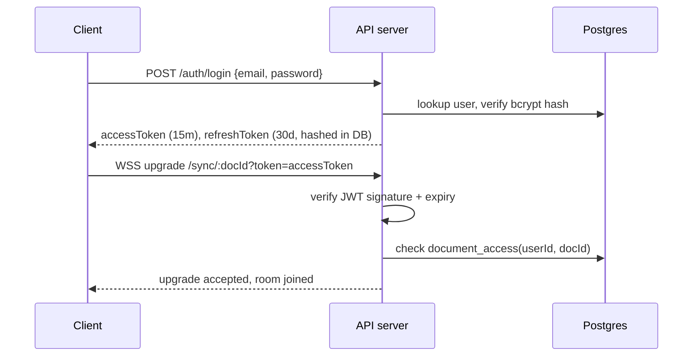

# CollabNotes — System Architecture Document

**Document status**: Approved for build
**Version**: 1.0
**Related documents**: `01-PRD.md`, `02-SRS.md`, `04-UIUX.md`, `05-DEVELOPMENT_PLAN.md`

---

## 1. Architecture Overview (C4 — Context Level)



CollabNotes is a single deployable system (for MVP) composed of a React SPA, a Node/Express API + WebSocket server, PostgreSQL, and Redis. It integrates with Google OAuth as its only external dependency.

## 2. Architecture Decision Records (ADRs)

### ADR-1: CRDT (Yjs) over Operational Transform
**Decision**: Use Yjs for document sync rather than a hand-built OT implementation.
**Rationale**: OT requires a central sequencing authority and is notoriously difficult to implement correctly (Google Docs' own OT took years to harden). Yjs is a mature, widely-adopted CRDT library with first-class rich-text editor bindings, and does not require a single source of truth server, which directly enables the horizontal scaling approach in §7.
**Alternative considered**: Automerge — also CRDT-based, but Yjs has better performance benchmarks for text and a more mature editor-binding ecosystem (Tiptap, ProseMirror, Quill, Monaco).

### ADR-2: Tiptap as the rich-text editor
**Decision**: Use Tiptap (built on ProseMirror) with its official `@tiptap/extension-collaboration` package.
**Rationale**: Ships a maintained Yjs binding out of the box; ProseMirror's schema model handles rich-text structure (headings, lists) robustly.

### ADR-3: Custom Postgres + Redis persistence/relay, not `y-redis`
**Decision**: Build a lightweight custom relay (Redis pub/sub) and persistence layer (Postgres update log + snapshot compaction) rather than adopting Yjs's official `y-redis` package.
**Rationale**: `y-redis` is dual-licensed AGPL/commercial — unsuitable to depend on without a commercial license. The underlying pattern it uses (Redis as a fast transient bus, a durable store for long-term persistence) is well documented and straightforward to reimplement at this project's scale without needing `y-redis`'s more advanced memory-efficiency features (which matter at a scale far beyond this project's target).

### ADR-4: JWT access token + rotating refresh token over session cookies
**Decision**: Stateless short-lived JWT for API auth, opaque rotating refresh token (hashed at rest) for renewal.
**Rationale**: Matches the pattern already proven in the author's prior project; keeps the WebSocket auth handshake simple (token passed at upgrade time, verified statelessly without a DB round-trip for every message).

### ADR-5: Monorepo layout
**Decision**: Single repository with `apps/api`, `apps/web`, `packages/shared`.
**Rationale**: Shared TypeScript types (DTOs from SRS §5.6) between frontend and backend without publishing an internal npm package; simpler CI for a solo-developer project.

### ADR-6: socket.io instead of raw `ws` for the realtime transport
**Decision**: Use `socket.io`/`socket.io-client` for the sync + awareness transport instead of the raw `ws` library and the custom envelope-byte protocol originally sketched in §5.5 of the SRS.
**Rationale**: socket.io's rooms map directly onto "one room per document" (FR-13/FR-14), its named events replace the 0x00–0x03 envelope byte with typed, self-describing messages, and its built-in reconnection (exponential backoff) plus automatic buffering of emits made while disconnected cover most of FR-16 without bespoke retry/queueing code. The wire-level protocol changed; the semantics (FR-12 through FR-17) did not — see `packages/shared/src/realtime.ts` for the actual event contract now in force, which supersedes SRS §5.5's byte layout.
**Trade-off accepted**: a socket.io connection isn't a plain WebSocket (it falls back to HTTP long-polling, and speaks its own framing on top of the WS upgrade), so it's a heavier dependency than raw `ws`. Acceptable at this project's scale for the reconnection/room ergonomics it buys back.

---

## 3. Tech Stack

| Layer | Choice | Key packages |
|---|---|---|
| Frontend framework | React + TypeScript | `react`, `react-dom`, `vite` |
| Rich text editor | Tiptap | `@tiptap/react`, `@tiptap/starter-kit`, `@tiptap/extension-collaboration`, `@tiptap/extension-collaboration-cursor` |
| CRDT | Yjs | `yjs`, `y-protocols` |
| Realtime transport | socket.io | `socket.io` (server), `socket.io-client` (client) — see ADR-6 |
| Backend framework | Node.js + Express | `express`, `zod` (validation), `helmet`, `express-rate-limit`, `cors` |
| Auth | JWT + bcrypt | `jsonwebtoken`, `bcrypt` |
| Database | PostgreSQL | `pg` (or `postgres.js`) |
| Cross-instance relay | Redis | `ioredis` |

## 4. Repository / Folder Structure

```
collabnotes/
├── apps/
│   ├── web/                        # React SPA
│   │   ├── src/
│   │   │   ├── components/
│   │   │   ├── pages/               # Dashboard, Editor, Login, Register
│   │   │   ├── hooks/                # useYjsDocument, useAuth, usePresence
│   │   │   ├── lib/                  # api client, websocket provider
│   │   │   └── main.tsx
│   │   └── vite.config.ts
│   └── api/                        # Express API + WS server
│       ├── src/
│       │   ├── routes/               # auth.ts, documents.ts, sharing.ts, snapshots.ts
│       │   ├── realtime/             # socket.io wiring, room manager, sync + awareness relay (ADR-6)
│       │   ├── services/             # authService, documentService, persistenceService
│       │   ├── db/                   # migrations/, queries/
│       │   ├── middleware/           # authGuard, rateLimiter, errorHandler
│       │   └── server.ts
│       └── tsconfig.json
├── packages/
│   └── shared/                     # DTO types shared by web + api (SRS §5.6)
└── .env.example                    # documents required environment variables (see §9)
```

## 5. Component Responsibilities

- **Room manager** (`apps/api/src/ws/`): tracks which sockets belong to which document room in-memory per server instance; on message, relays to local room members and publishes to the document's Redis channel for cross-instance delivery.
- **Sync handler**: implements the `y-protocols/sync` handshake (sync step 1/2) on new connection, and relays subsequent update messages (§5.5 of SRS).
- **Awareness handler**: separate, ephemeral channel for cursor/presence data — never written to Postgres (it's not part of durable document content).
- **Persistence service**: subscribes to the same Redis channel (or hooks directly into the room manager) to append every update to `document_updates`, and runs the periodic compaction job described in §6.2.
- **Auth guard middleware**: verifies JWT on every REST request; for WebSocket, verification happens once at upgrade time (see §8).

## 6. Data Flow

### 6.1 Single edit (as previously diagrammed in conversation)
1. Client types → local Yjs doc updates instantly, Tiptap re-renders.
2. Yjs emits a binary update → sent over the client's open WebSocket.
3. Receiving server instance relays it to same-instance room members, and `PUBLISH`es it to Redis channel `doc:<documentId>:updates`.
4. Other server instances `SUBSCRIBE`d to that channel receive it and relay to their local room members.
5. Persistence service appends the raw update bytes to `document_updates` (async, non-blocking).

### 6.2 Snapshot creation (simplified — no deletion step for MVP)
On a timer (or after N accumulated updates) per active document:
1. Load all `document_updates` rows for the document since the last snapshot.
2. Merge them into a `Y.Doc` in memory via `Y.applyUpdate` for each row, in order.
3. Write the merged state as a new row in `document_snapshots` via `Y.encodeStateAsUpdate`.
This gives version history a natural, cheap listing source (`document_snapshots`). Deleting the now-redundant `document_updates` rows is deliberately **not** done for MVP (see SRS §6 compaction note) — it's a real correctness risk (a delete racing a still-arriving update) for a storage saving this project doesn't need yet.

### 6.3 Redis channel design
- Channel naming: `doc:<documentId>:updates` for content, `doc:<documentId>:awareness` for presence — kept separate so a noisy cursor-tracking stream never competes with durable content updates in the same channel.
- Simplest correct MVP implementation: a server instance subscribes to a document's channels when the first local client joins that room. Unsubscribing when the last local client leaves is a valid resource optimization, but skip it for MVP — at this project's scale (a handful of documents, not thousands), leaving a subscription open a little longer than strictly necessary costs nothing meaningful and removes a class of "did we unsubscribe at the right moment" bugs.

## 7. Scalability

- The WS/API server is stateless with respect to document content (all durable state lives in Postgres; all cross-instance coordination goes through Redis), so it scales horizontally by simply adding instances behind a load balancer.
- WebSocket connections do not require sticky sessions for correctness (Redis relay makes cross-instance delivery transparent), though sticky sessions can still be used as a minor optimization to avoid unnecessary relay hops.
- Postgres scaling (read replicas, connection pooling via `pgbouncer`) is noted as future work — not required at MVP scale (§2.1 Overall Description, SRS).

## 8. Authentication & Authorization Flow



- Access tokens are verified statelessly (signature + expiry only) — no DB hit per WebSocket message, only at connection time.
- Refresh rotation: each use of a refresh token issues a new one and invalidates the old; reuse of an already-rotated token revokes the whole `family_id` (SRS FR-5), forcing full re-login — this is the standard defense against stolen refresh tokens.

## 9. Deployment

No containerization for this project — running the built Node process directly is simpler and sufficient at this scale, and skips a whole layer (image builds, registries, container runtime config) that doesn't pay for itself for a single-service solo build.

- **Local development**: install Postgres and Redis directly on the dev machine (or use any existing local instances), run `npm run dev` for both `apps/api` and `apps/web`.
- **Production**: build with `npm run build`, then run the compiled server directly (`node apps/api/dist/server.js`) on a Node-friendly host (a small VM, or any PaaS that runs a Node process and gives you a managed Postgres + Redis add-on). Point the frontend build's API/WS URLs at that host via environment variables at build time.
- **Process management**: a simple process supervisor (e.g. `pm2`, or the host platform's own process restart policy) is enough to keep the server running and auto-restart on crash — no orchestration platform needed.

**Environment variables**:
| Variable | Purpose |
|---|---|
| `DATABASE_URL` | Postgres connection string |
| `REDIS_URL` | Redis connection string |
| `JWT_SECRET` | HMAC signing key for access tokens |
| `GOOGLE_CLIENT_ID` / `GOOGLE_CLIENT_SECRET` | OAuth credentials |
| `CORS_ORIGIN` | Allowlisted frontend origin(s) |
| `SNAPSHOT_INTERVAL_MS` | Compaction job interval (default 600000 = 10 min) |

## 10. Observability

Kept intentionally minimal — no Prometheus/Grafana/ELK stack for this project. That's a real over-engineering trap for a solo portfolio build: standing up a metrics/logging platform costs days and demonstrates nothing the interviewer will ask about.

- **Health check**: `GET /health` verifies Postgres and Redis connectivity, returns 200/503. This alone is enough for a single-deployment portfolio app.
- **Structured logs**: plain JSON `console.log` lines with `requestId`, `userId`, `documentId` where relevant; auth failures and access-denied events logged distinctly. That's sufficient to debug the app and to demonstrate the *practice* of structured logging without needing a log aggregation service to view it.
- Latency and throughput figures for the README (e.g. p95 update-relay latency) can be measured ad hoc during testing/demo prep — this doesn't need to be a standing, always-on metrics pipeline.

## 11. Security Architecture Notes
- All traffic TLS-terminated at the load balancer; internal traffic to Postgres/Redis stays within a private network.
- WebSocket upgrade requests are authenticated before the room join — never after (SRS FR-14, FR-17).
- Redis is used purely as a transient bus; no durable or sensitive data is ever stored there, so its loss on restart is an acceptable operational event, not a data-loss event.

## 12. Future Extension Points (explicitly not built now, but the architecture doesn't block them)
- Splitting the WS relay and REST API into separate deployable services (already decoupled via Redis, so this is a deployment change, not a code rewrite).
- Swapping the custom persistence layer for `y-redis` later if a commercial license is obtained and scale demands it.
- Adding a search/indexing service reading from `document_snapshots` without touching the real-time path.

## 13. Explicitly Avoided Complexity (and why)
Called out deliberately so it's never mistaken for a gap:
- **No microservices split.** One deployable API/WS service is correct at this scale; splitting services before you have a reason to scale them independently is pure overhead.
- **No Kubernetes / orchestration platform.** Docker Compose locally, a single container in production. K8s solves problems (multi-node scheduling, autoscaling policy) this project doesn't have.
- **No message queue beyond Redis pub/sub.** Something like Kafka/RabbitMQ would be solving for durability and backpressure at a throughput this app never approaches — Redis pub/sub is the right-sized tool for "relay a message to other instances."
- **No Postgres read replicas or connection pooler (pgbouncer).** A single Postgres instance comfortably handles this project's write/read volume.
- **No CDN or edge caching layer.** There's no static-asset or geographic-latency problem here to justify one.
- **No `y-redis` dependency** (ADR-3) — not because it's bad, but because its licensing and its memory-efficiency features are aimed at a scale and commercial context this project isn't in.
- **No full observability stack** (§10) — health check + structured logs cover what a solo build actually needs to debug and demo.
- **No update-log compaction/deletion** (§6.2) — an optimization for data volumes this project won't reach, deferred rather than built speculatively.
- **No containerization (Docker) or CI/CD pipeline.** Running the built Node process directly, with tests run locally before merging, is simpler and just as credible for a solo portfolio project — containerization and pipeline automation pay off when multiple people or environments need reproducibility guarantees, which isn't the situation here.

The test applied throughout: does this component solve a problem the project actually has at its actual scale, or a problem a much bigger system would have? Anything in the second category stayed out.
